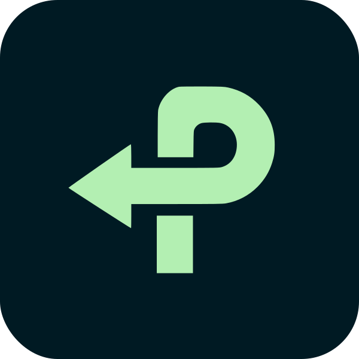

<a id="readme-top"></a>

[![Contributors][contributors-shield]][contributors-url]
[![Forks][forks-shield]][forks-url]
[![Stargazers][stars-shield]][stars-url]
[![Issues][issues-shield]][issues-url]

<br />
<div align="center">
  <a href="https://github.com/NoanWasTaken/pivot">
    
  </a>

<h3 align="center">PIVOT</h3>

  <p align="center">
    Check your Steam library's compatibility with Linux — find out if you can make the switch.
    <br />
    <a href="https://github.com/NoanWasTaken/pivot"><strong>Explore the docs »</strong></a>
    <br />
    <br />
    <a href="https://pivot.noandelatouche.dev">View Demo</a>
    &middot;
    <a href="https://github.com/NoanWasTaken/pivot/issues/new?labels=bug&template=bug-report---.md">Report Bug</a>
    &middot;
    <a href="https://github.com/NoanWasTaken/pivot/issues/new?labels=enhancement&template=feature-request---.md">Request Feature</a>
  </p>
</div>

<details>
  <summary>Table of Contents</summary>
  <ol>
    <li>
      <a href="#about-the-project">About The Project</a>
      <ul>
        <li><a href="#built-with">Built With</a></li>
      </ul>
    </li>
    <li>
      <a href="#getting-started">Getting Started</a>
      <ul>
        <li><a href="#prerequisites">Prerequisites</a></li>
        <li><a href="#installation">Installation</a></li>
      </ul>
    </li>
    <li><a href="#usage">Usage</a></li>
    <li><a href="#roadmap">Roadmap</a></li>
    <li><a href="#contributing">Contributing</a></li>
    <li><a href="#license">License</a></li>
    <li><a href="#contact">Contact</a></li>
    <li><a href="#acknowledgments">Acknowledgments</a></li>
  </ol>
</details>

## About The Project

PIVOT helps Windows gamers evaluate whether switching to Linux is viable for their Steam library. Enter your Steam ID and get an instant breakdown of how your games run on Linux via ProtonDB ratings, with filters by compatibility tier and game name.

The project includes a "Why?" page explaining the benefits of Linux for gaming and curated distro recommendations.

### Built With

* [![Next][Next.js]][Next-url]
* [![React][React.js]][React-url]
* [![Hono][Hono.js]][Hono-url]
* [![Bun][Bun.js]][Bun-url]
* [![Tailwind][Tailwind.css]][Tailwind-url]

<p align="right">(<a href="#readme-top">back to top</a>)</p>

## Getting Started

To get a local copy up and running, you need both the client and the server.

### Prerequisites

- **Bun** (for the server) — `curl -fsSL https://bun.sh/install | bash`
- **Node.js >= 18** (for the client)
- A **Steam Web API key** from https://steamcommunity.com/dev/apikey

### Installation

1. Get a free Steam Web API Key at https://steamcommunity.com/dev/apikey
2. Clone the repo
   ```sh
   git clone https://github.com/NoanWasTaken/pivot.git
   cd pivot
   ```
3. Install server dependencies
   ```sh
   cd server && bun install
   ```
4. Set up server environment variables in `server/.env`
   ```env
   STEAM_API_KEY=your_api_key_here
   CORS_ORIGIN=http://localhost:3000
   ```
5. Install client dependencies
   ```sh
   cd ../client && npm install
   ```
6. Set up client environment variables in `client/.env`
   ```env
   NEXT_PUBLIC_SERVER_URL=http://localhost:3001
   ```
7. Start the server (from `server/`)
   ```sh
   bun run dev
   ```
8. Start the client (from `client/`)
   ```sh
   npm run dev
   ```
9. Open http://localhost:3000

<p align="right">(<a href="#readme-top">back to top</a>)</p>

## Usage

1. Go to the **Check** page
2. Enter your **Steam ID** or your **custom vanity URL name**
3. Click **Search** — the app fetches your owned games and checks each against ProtonDB
4. View your compatibility percentage, filter by tier (Native, Platinum, Gold, Silver, Bronze, Borked), or search by game name
5. Click any game card to open its ProtonDB page for details

Vanity URLs (e.g. `noanwastaken`) are automatically resolved. If you enter a 17-digit Steam ID, it's used directly.

<p align="right">(<a href="#readme-top">back to top</a>)</p>

## Roadmap

- [x] Steam ID / vanity URL resolution
- [x] Per-game ProtonDB compatibility lookup
- [x] Tier-based filtering
- [x] "Why?" page with Linux benefits and distro recommendations
- [ ] User-friendly error states for empty libraries
- [ ] Server-side caching to reduce API calls
- [ ] Docker Compose setup for one-command deploy

See the [open issues](https://github.com/NoanWasTaken/pivot/issues) for a full list of proposed features and known issues.

<p align="right">(<a href="#readme-top">back to top</a>)</p>

## Contributing

Contributions are what make the open source community such an amazing place to learn, inspire, and create. Any contributions you make are **greatly appreciated**.

If you have a suggestion that would make this better, please fork the repo and create a pull request. You can also simply open an issue with the tag "enhancement".
Don't forget to give the project a star! Thanks again!

1. Fork the Project
2. Create your Feature Branch (`git checkout -b feature/AmazingFeature`)
3. Commit your Changes (`git commit -m 'Add some AmazingFeature'`)
4. Push to the Branch (`git push origin feature/AmazingFeature`)
5. Open a Pull Request

<p align="right">(<a href="#readme-top">back to top</a>)</p>

### Top contributors

<a href="https://github.com/NoanWasTaken/pivot/graphs/contributors">
  
</a>

## License

Distributed under the MIT License. See `LICENSE.txt` for more information.

<p align="right">(<a href="#readme-top">back to top</a>)</p>

## Contact

Noan Delatouche — [@NoanWasTaken](https://twitter.com/NoanWasTaken) — delatouchenoan@gmail.com

Project Link: [https://github.com/NoanWasTaken/pivot](https://github.com/NoanWasTaken/pivot)

<p align="right">(<a href="#readme-top">back to top</a>)</p>

## Acknowledgments

* [Steam Web API](https://steamcommunity.com/dev)
* [ProtonDB](https://www.protondb.com/)
* [Best-README-Template](https://github.com/othneildrew/Best-README-Template)

<p align="right">(<a href="#readme-top">back to top</a>)</p>

[contributors-shield]: https://img.shields.io/github/contributors/NoanWasTaken/pivot.svg?style=for-the-badge
[contributors-url]: https://github.com/NoanWasTaken/pivot/graphs/contributors
[forks-shield]: https://img.shields.io/github/forks/NoanWasTaken/pivot.svg?style=for-the-badge
[forks-url]: https://github.com/NoanWasTaken/pivot/network/members
[stars-shield]: https://img.shields.io/github/stars/NoanWasTaken/pivot.svg?style=for-the-badge
[stars-url]: https://github.com/NoanWasTaken/pivot/stargazers
[issues-shield]: https://img.shields.io/github/issues/NoanWasTaken/pivot.svg?style=for-the-badge
[issues-url]: https://github.com/NoanWasTaken/pivot/issues
[license-shield]: https://img.shields.io/github/license/NoanWasTaken/pivot.svg?style=for-the-badge
[license-url]: https://github.com/NoanWasTaken/pivot/blob/main/LICENSE.txt
[Next.js]: https://img.shields.io/badge/next.js-000000?style=for-the-badge&logo=nextdotjs&logoColor=white
[Next-url]: https://nextjs.org/
[React.js]: https://img.shields.io/badge/React-20232A?style=for-the-badge&logo=react&logoColor=61DAFB
[React-url]: https://reactjs.org/
[Hono.js]: https://img.shields.io/badge/Hono-E36002?style=for-the-badge&logo=hono&logoColor=white
[Hono-url]: https://hono.dev/
[Bun.js]: https://img.shields.io/badge/Bun-000000?style=for-the-badge&logo=bun&logoColor=white
[Bun-url]: https://bun.sh/
[Tailwind.css]: https://img.shields.io/badge/Tailwind_CSS-38B2AC?style=for-the-badge&logo=tailwind-css&logoColor=white
[Tailwind-url]: https://tailwindcss.com/
